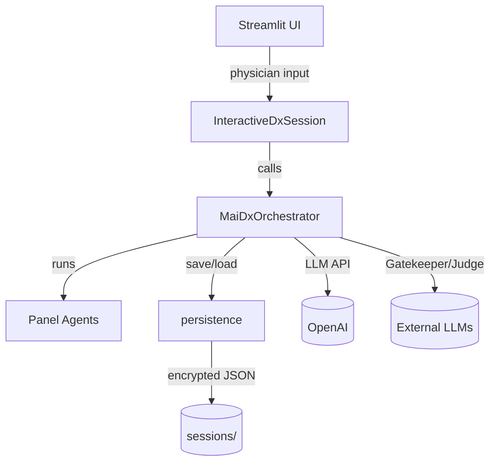
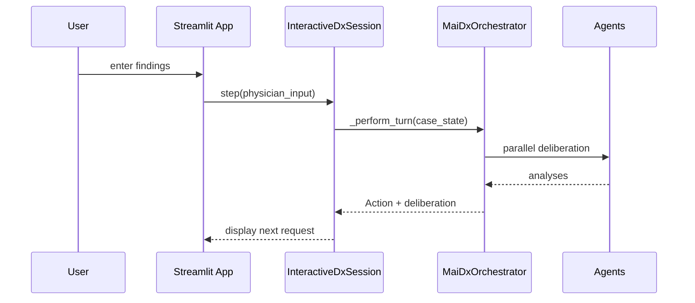
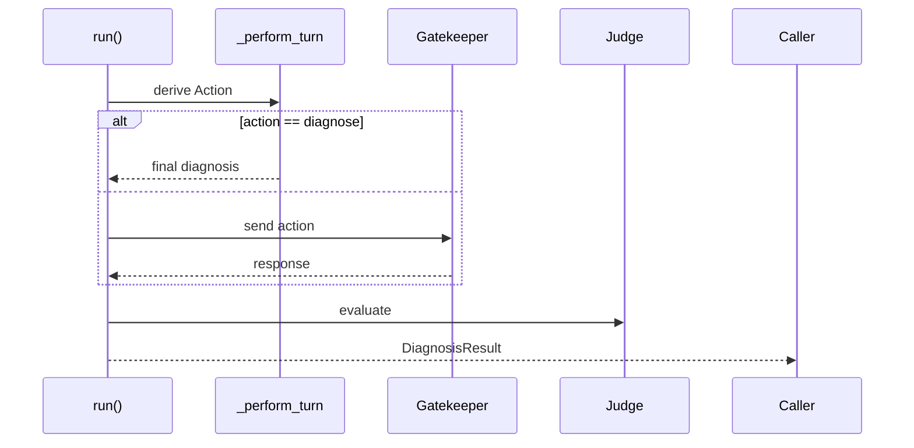
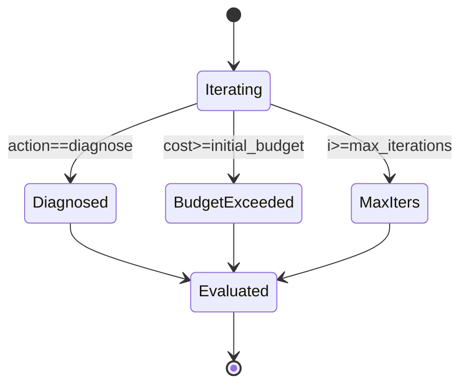
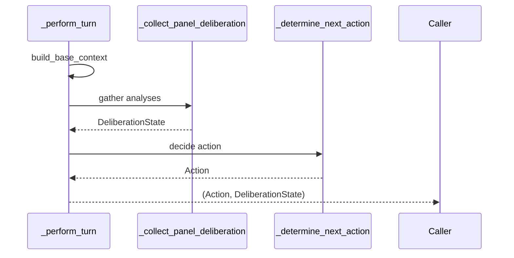
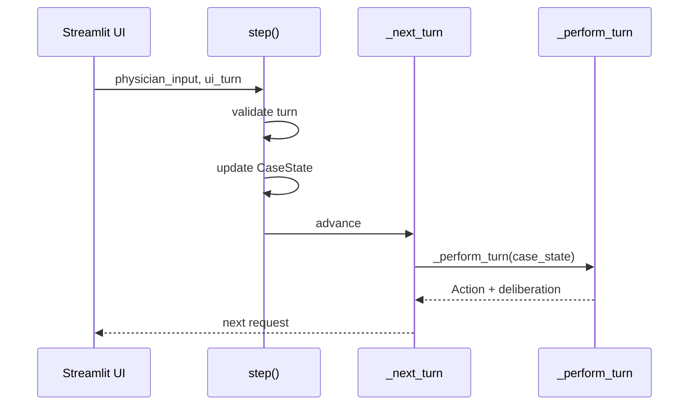
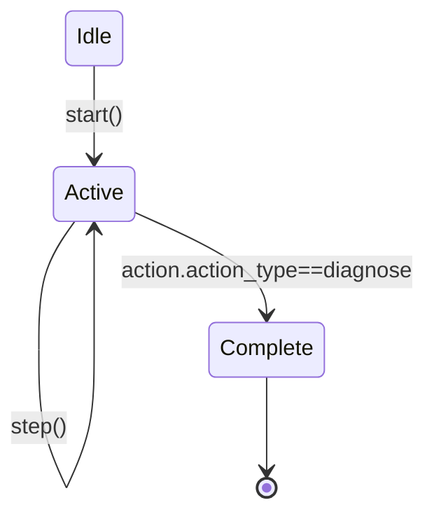

# CODex Findings for DxO

## Architecture Overview
DxO is a language‑model–driven diagnostic orchestrator composed of multiple "physician" agents that deliberate sequentially. It offers two run modes: a Streamlit interactive UI and a headless autonomous benchmark runner【F:README.md†L22-L27】. The core orchestration lives in `mai_dx/main.py`, where `MaiDxOrchestrator` manages agent initialization, parallel deliberation and consensus to decide the next diagnostic action【F:mai_dx/main.py†L239-L370】【F:mai_dx/main.py†L520-L638】.

### Repo Map
- `app.py` – Streamlit UI entry point.
- `example_autonomous.py` – CLI benchmark run.
- `config.py` – default prompts, model list and test costs.
- `llm_client_factory.py` – selects OpenAI Responses vs Chat Completions API.
- `mai_dx/` – core orchestrator, data structures, persistence and UI helpers.
- `scripts/install_dependencies.py` – optional dependency installer.
- `tests/` – unit tests for parsing and persistence.
- `swarms_utils/` – lightweight wrappers around external `swarms` utilities.

## Component Catalog
| Component | Purpose | Key API | Inputs → Outputs | Dependencies |
| --- | --- | --- | --- | --- |
| `LLMClient` (`llm_client_factory.py`) | Unified OpenAI client choosing Responses or Chat API | `generate(messages, system_prompt)` | chat messages → `(text, raw_response)` | `openai` SDK, `_use_responses_api` |
| `MaiDxOrchestrator` (`mai_dx/main.py`) | Coordinates multi‑agent diagnostic loop | `create_variant()`, `run()`, `_perform_turn()` | case state → action & deliberation | `swarms`, `pydantic`, prompts, costing |
| `InteractiveDxSession` (`mai_dx/interactive.py`) | Wraps orchestrator for Streamlit UI | `start()`, `step()`, `update_runtime_params()` | user inputs → session turns persisted | `MaiDxOrchestrator`, `persistence`, `costing` |
| `persistence` (`mai_dx/persistence.py`) | Encrypts/decrypts session files | `save_session()`, `load_session()`, `list_sessions()` | session dict ↔ encrypted JSON | `.env` (`MAI_DX_SECRET`), `cryptography` |
| `costing` (`mai_dx/costing.py`) | Lookup diagnostic test costs | `estimate_cost(tests, db)` | tests → cost int | `config.DEFAULT_TEST_COSTS` |
| UI module (`mai_dx/ui/*`) | Streamlit components for visualization & controls | e.g., `display_current_request()`, `render_settings_panel()` | session state → UI widgets | `streamlit`, `plotly` |

## Build/Run Path
1. **Interactive UI** (`streamlit run app.py`): `app.py` initializes the Streamlit session, collects settings, and instantiates `LLMClient`. User inputs spawn an `InteractiveDxSession`, which calls `_perform_turn` on `MaiDxOrchestrator` each time the physician responds.
2. **Autonomous CLI** (`python example_autonomous.py`): creates an orchestrator variant with `MaiDxOrchestrator.create_variant`, then executes `run` which loops through `_perform_turn`, interacts with a Gatekeeper for simulated patient responses, and finishes with Judge scoring.

### Main Control Loop
`MaiDxOrchestrator._perform_turn` builds shared context, runs panel agents in parallel (`ThreadPoolExecutor`), checks for stagnation, determines the next action via Consensus, and validates it【F:mai_dx/main.py†L590-L638】.

## Dataflow Overview
### Component Diagram

### Sequence: Interactive Turn

### Dataflow Summary
1. User provides findings → Streamlit UI → `InteractiveDxSession` updates `CaseState`.
2. `MaiDxOrchestrator` aggregates agent analyses → Consensus action.
3. Actions/tests update cost and differential; in autonomous mode the Gatekeeper supplies responses.
4. Session snapshots are encrypted and written to `sessions/` via `persistence.save_session`.

## Motor
### MaiDxOrchestrator.run – autonomous loop

**Data contract**
- **Inputs**: `initial_case_info` (str), `full_case_details` (str), `ground_truth_diagnosis` (str).
- **Output**: `DiagnosisResult` with final diagnosis, score, cost, iterations.
- **Errors**: gatekeeper/Judge failures return placeholder strings; no retries or timeouts.
**State transitions**

**Concurrency & back-pressure** – sequential loop; each iteration invokes `_perform_turn` then optional Gatekeeper call. Agent calls inside `_perform_turn` are delayed by `request_delay` but lack rate-limit back-pressure.
**Hazards** – forced diagnosis when budget exceeded; Gatekeeper role misnaming (`GATEKeeper`) can raise `AttributeError`; external calls lack timeout/retry, so a hung LLM blocks progress【F:mai_dx/main.py†L720-L783】【F:mai_dx/main.py†L690-L704】.

### MaiDxOrchestrator._perform_turn – per-turn deliberation

**Data contract**
- **Input**: `CaseState` with vignette, cost, differential etc.
- **Output**: `(Action, DeliberationState)`.
- **Errors**: if Hypothesis agent fails → RuntimeError triggers fallback `ask`; other agent failures store placeholder text.
**State transitions** – context built → agents deliberate → stagnation check → consensus action → optional correction for mode/budget → return.
**Concurrency & back-pressure** – Hypothesis runs first; remaining four agents execute in a `ThreadPoolExecutor` without timeouts【F:mai_dx/main.py†L528-L548】. Each agent call sleeps for `request_delay` but no batching or retry【F:mai_dx/main.py†L404-L412】.
**Hazards** – parallel agent calls may exceed rate limits; differential update parsing can fail silently; stagnation detection relies on last actions and may miss nuanced repetition【F:mai_dx/main.py†L590-L638】.

### InteractiveDxSession.step / _next_turn – interactive handler

**Data contract**
- **step inputs**: `physician_input` (str), `ui_turn_number` (int); raises `ValueError` if mismatch or session complete.
- **step output**: None; side-effects mutate `CaseState` and append `Turn`.
**State transitions**

**Concurrency & back-pressure** – strictly sequential; each call persists to disk; no throttling around `_perform_turn`.
**Hazards** – UI/session turn mismatch raises error requiring page refresh; persistent storage errors are surfaced via Streamlit; LLM failures propagate into session turns with minimal recovery【F:mai_dx/interactive.py†L70-L106】【F:mai_dx/interactive.py†L107-L144】.

## Configuration & IO Map
- **Environment variables**: `OPENAI_API_KEY`, `GEMINI_API_KEY`, `MAI_DX_SECRET` for session encryption, `MAIDX_DEBUG` for verbose logs【F:README.md†L48-L55】【F:mai_dx/persistence.py†L46-L59】
- **Files**: `.env` for keys, `sessions/*.json` (encrypted), optional `logs/` for debug output.
- **Network**: OpenAI API via `openai` or `litellm`; external LLMs act as Gatekeeper/Judge during autonomous runs.
- **Flags/CLI**: mode selection (`no_budget`, `budgeted`, `question_only`) when creating orchestrator variants.

## Invariants & Contracts
- Diagnostic cycle must follow Observe → Decide → Act → Update (non‑negotiable per core spec).
- `Action` objects require `action_type` ∈ {`ask`,`test`,`diagnose`}, `content`, and `reasoning` enforced by `pydantic`【F:mai_dx/structures.py†L16-L34】.
- Differential entries must have probabilities between 0 and 1【F:mai_dx/main.py†L239-L244】【F:mai_dx/main.py†L656-L676】.
- Interactive session turn numbers must stay in sync with UI, otherwise `ValueError` is raised【F:mai_dx/interactive.py†L82-L88】.
- Sessions are encrypted with a persistent Fernet key; absence generates one and updates `.env`【F:mai_dx/persistence.py†L49-L59】.

## Risk Register
| Risk | Severity | Symptom/Quick Repro | Suggested Fix |
| --- | --- | --- | --- |
| **Incorrect enum name for Gatekeeper** (`AgentRole.GATEKeeper`) causes `AttributeError` when autonomous mode calls `_interact_with_gatekeeper` | High | Run `example_autonomous.py` → crash before first gatekeeper call | Fix enum reference to `AgentRole.GATEKEEPER`; add tests for gatekeeper path |
| **LLM call concurrency without timeouts** may hit rate limits or hang | Med | Simultaneous agent runs via `ThreadPoolExecutor` stall or fail under slow network | Add per‑request timeouts and retry/backoff logic |
| **Insecure fallback encryption** when `cryptography` missing stores sessions base64‑encoded | Med | Omit `cryptography` dependency and inspect saved file → readable | Require `cryptography` in production or warn user, disable saving without secure key |
| **API key persistence in plain text** (`app.py` writes to `.env`) | Med | Key stored unencrypted on disk | Use OS keyring or instruct users about security implications |
| **Limited test coverage of orchestrator logic** | Low | Modify `_perform_turn` and run tests → none fail | Add unit tests covering agent orchestration, budget modes, and gatekeeper/judge flows |

## Test & Tooling Baseline
- **Test framework**: `pytest` (`tests/` folder). Running `pytest -q` executes 8 tests focusing on parser robustness, persistence, and dependency shadowing; all pass【052f4b†L1-L2】.
- **Coverage gaps**: no tests for Streamlit UI, agent concurrency, cost budgeting, or autonomous run flows. Roughly covers <20% of modules.
- **Tooling**: no linting or type-check scripts detected; optional `scripts/install_dependencies.py` installs runtime packages.

## Backlog
| Item | Impact | Effort | Confidence | Acceptance Criteria |
| --- | --- | --- | --- | --- |
| Orchestrator flow tests cover budgeted, question_only, and gatekeeper/judge paths | 4 | 3 | 4 | Pytest suite exercises `_perform_turn` and `run()` under each mode with stubbed Gatekeeper/Judge interactions; all tests pass |
| Add timeout and retry around LLM calls | 5 | 3 | 3 | `_safe_agent_run` or `LLMClient.generate` enforces configurable timeout and single retry with backoff; simulated timeouts confirm recovery |
| Fix Gatekeeper enum typo and add guard tests | 3 | 1 | 5 | `example_autonomous.py` runs without `AttributeError`; unit test verifies `_interact_with_gatekeeper` uses `AgentRole.GATEKEEPER` |
| Harden session persistence with cryptography requirement and fallback warning | 3 | 2 | 4 | Saving a session without `cryptography` raises explicit warning/error; tests validate secure key requirement and fallback behavior |
| Introduce dependency injection for swarms/OpenAI clients | 2 | 3 | 3 | Orchestrator accepts pluggable client factories so tests can supply stubs without monkeypatching |

---
Generated on 2025-09-02.
